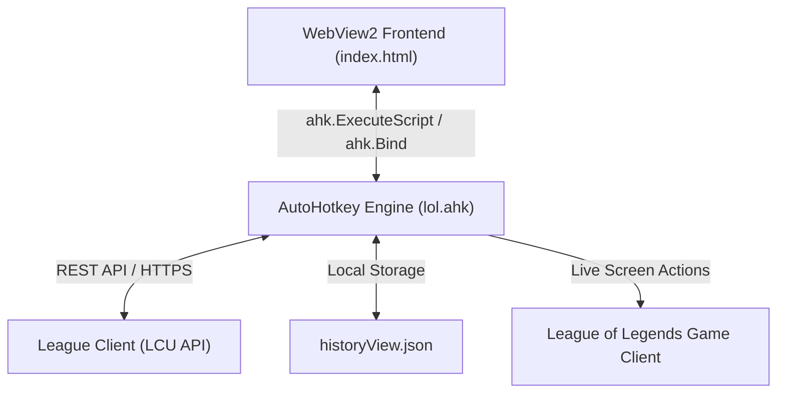

# Roadmap: LoL Multitool UI & Feature Improvements

This roadmap outlines a series of visual and functional enhancements to transition the League Multitool application from a simple local automation script to a premium, configurable, and feature-rich gaming companion.

---

## 🗺️ Project Vision
The main objective is to replace static configurations, raw JSON outputs, and default Bootstrap templates with a dynamic **Hextech-inspired dashboard** that allows real-time plugin toggling, custom delay configurations, and advanced client actions.

---

## 🎨 Phase 1: UI Modernization (Hextech Aesthetic)
The current UI uses basic Bootstrap components. The proposed visual redesign shifts to a premium dark-themed overlay inspired by League's client aesthetics.

### 🌟 1. Theme and Core Styling
*   **Color Palette**: Shift away from standard Bootstrap gray to a Void & Gold theme:
    *   **Primary Background**: Deep Void/Obsidian (`#0a0e13` to `#101822`) with subtle glassmorphism (`backdrop-filter: blur(12px)`).
    *   **Accent Borders**: Hextech Gold (`#c89b3c` / `#a07c32`) and Runeterra Blue (`#005a82`).
*   **Typography**: Load specialized game-aligned sans-serif typephones (e.g., *Beaufort for LOL* or *Spiegel* styling using Google Fonts like **Inter** or **Outfit**).
*   **Transitions**: Apply micro-animations (e.g., `transition: all 0.3s ease`) to side navigation tabs, buttons, and status icons.

### 📊 2. Home Dashboard Refactor
Instead of displaying raw JSON outputs in `#jsonBox`, the Home Tab (index.html) will feature:
*   **Summoner Profile Card**: Display current summoner name, profile icon (fetched from LCU `/lol-chat/v1/me`), account level, and current online status.
*   **LCU Connection Status Indicator**: A pulsing glow indicator showing connection health (Green for online, Red for offline, Orange during Ready Checks).
*   **Reporting History Timeline**: A clean list of match report cards. Each card displays:
    *   Game Mode & Match ID.
    *   List of reported names (grouped by match).
    *   A direct clickable button to view the game history on `League of Graphs`.

### ⚙️ 3. Settings Interface Sync
*   Replace dummy placeholder fields (e.g. Email/Sign-in form) with practical configurations that directly sync with the AutoHotkey script.

---

## ⚙️ Phase 2: Backend Control & Dynamic Configuration
Currently, settings like surrendering in TFT, enabling plugins, and reports are hardcoded. We want to expose these to the frontend using WebViewToo bindings.

### 🔌 1. Dynamic Plugin Management
*   **Enable/Disable Toggles**: Move away from editing plugins.ahk to toggle plugins. Introduce checkboxes/switches in the UI to dynamically toggle variables inside lol.ahk (e.g., `autoAcceptEnabled := true`).
*   **Adjustable TFT Delay & Threshold**: Add slider inputs in the settings panel to change the TFT farm surrender threshold (currently hardcoded as `600s` in autoTFT.ahk) and write changes directly to a configuration file.

### ⏱️ 2. Auto-Accept Queue Humanizer
*   **Queue Accept Delay**: Add an adjustable slider (0–5 seconds) to wait before accepting a queue matchmaking search. Instantly accepting every queue check increases account flagging risk.

### 🔍 3. Refined Auto-Reporting Filters
Currently, autoReportNew.ahk mass-reports all players who are not on your friends list.
*   **Friend / Party Exclusions**: Add options to exclude premades and team members, or only report enemy team members.
*   **Violation Category Picker**: Select which categories to send (e.g., toggle *Negative Attitude*, *Verbal Abuse*, *Hate Speech*, or *Third Party Tools*).

---

## 🚀 Phase 3: Extra Features & Utilities
These new features can be integrated via LCU API endpoints and screen automation.

| Feature Name | Description | LCU Endpoint / Method |
| :--- | :--- | :--- |
| **Lobby Multi-Search Scraper** | When entering champion select, automatically grab all teammate summoner names and construct a multi-search lookup link (OP.GG, U.GG, or League of Graphs) to instantly open in a browser. | `GET /lol-champ-select/v1/session` |
| **Champion Instalock / Hover** | Configure a specific champion ID to hover and lock in immediately when Champ Select begins (ideal for rapid locks). | `PATCH /lol-champ-select/v1/session/my-selection` |
| **Automated Ban List** | Pre-configure a priority champion to auto-ban in ranked drafts. | `PATCH /lol-champ-select/v1/session/actions/{id}` |
| **Active Chat Filter** | Read active champion select chat logs. Highlight toxic words to help pre-determine lobby dodges. | `GET /lol-chat/v1/conversations/{id}/messages` |
| **Lobby Dodger** | A hotkey or UI button to instantly dodge champion select by closing the queue handler cleanly. | `POST /lol-login/v1/shutdown-and-disable` |

---

## 🛠️ Implementation Plan & Priority

1.  **High Priority (Immediate Impact)**:
    *   Redesign index.html and custom.css to apply the Hextech color scheme.
    *   Expose dynamic toggles for autoAccept.ahk and autoReportNew.ahk.
    *   Show recent match report history as styled cards instead of raw JSON dumps.
2.  **Medium Priority (Configuration & Controls)**:
    *   Implement variable timer controls for the autoTFT.ahk farm plugin.
    *   Create settings section for report categories and queue accept delays.
3.  **Low Priority (Feature Expansion)**:
    *   Build the Lobby Multi-Search scraper for champ select.
    *   Develop Champ Select instalock/ban automation rules.
